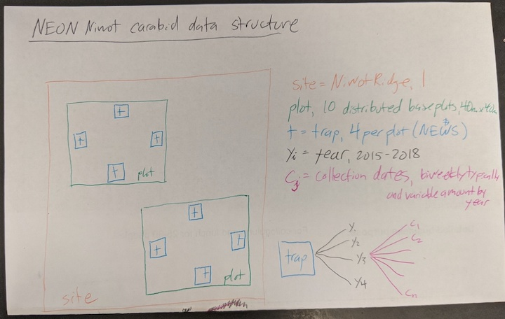

Spring 2020 CU Boulder EBIO Ecological Forecasting Seminar
Project: NEON-Niwot forest species SDMs

This is a centralized location to organize our thoughts and resources for this project. Thoughts and data are focused on Niwot Ridge site, unless specified otherwise.

##### Scientific questions
Our goal for the semester is to answer as many of these questions, in the following order:
1. For each species respectively, what are the key predictor variables (e.g. environmental, canopy cover, etc.)?
2. What model best predicts species abundance spatially?
    - Leave out one plot or one from each biome from training set
    - Cross-validate different models. Which cross-validation method to use?
3. What model best predicts species abundance in the 2019 collection season?
4. What are our predictions for the 2020 collection season?
5. How many years of data do you need to “accurately” forecast species abundances at different future time steps? 
    - Define level of accuracy. 

**Other brainstorming questions**
1. How will carabid species distributions shift with global warming in a subalpine forest?  
1. Is there a shift in community composition through time at all in the NEON data available? For multiple sites, account for habitat and environmental differences. see Brooks et al. 2012 hyp1
1. Across NEON sites, do temporal community trends differ in magnitude and direction between habitats and regions? see Brooks et al. 2012 hyp2
1. Are community trends unique to combinations of habitats and regions? That is, might we expect species's responses to environmental change to be dictated mostly by habitat? see Brooks et al. 2012 hyp3
2. What are shifts in phenology of species through time? see Hoekman et al. 2017  
3. What is carabid community response to habitat and land-use change over time?  
4. What are shifts in phenology of species through time and across habitat? see Hoekman et al. 2017
5. Is fine-scale change in microhabitat heterogeneity more important to carabid abundance and richness than larger-scale changes in landscape diversity? Could more stable habitats (e.g. forest) buffer wider-scale perturbations? see Brooks et al. 2012
6. "How much data is enough to forecast accurately?": Develop a prediction model and run it (say) 35 years into the future. Assume this forecast data is real. Re-run the model, giving it varying amounts of "real" data (1 yr, 3 yrs, 5 yrs, 10 yrs etc). For each amount of "real" data, assess forecast accuracy at various timesteps; i.e. how far into the future can we accurately forecast with a given amount of "real" data? Figure out how to predict standard error change through time by simulating fake data.
7. Predict beetle abundance and and composition at a different spot in the same year. Or forecast rel abundance for the next collection period
8. Brett feedback from class pres - we're describing a bootstrapped forecast (generating fake data - if this is the truth, what uncertainty is there?) Think about the generative process in data collection

##### Why carabids?
* identifying habitat associations in a dominant insect group would be an important step toward understanding the consequences of global climate change in high mountain areas  (Hiramatsu and Usio 2018)
* Because of their known sensitivity to changes in habitat structure and requisitly altered microhabitat, carabid beetles have been suggested to serve as useful bioindicators of environmental and land use change (Hiramatsu and Usio 2018)
* To date, numerous studies have shown that carabid beetle richness and/or assemblage composition change along altitudinal gradients [5–7] and/or with vegetation type [8–11] (Hiramatsu and Usio 2018)
* Remote sensing can measure carabid habitat at the local and landscape scales. Identifying the predictive relationships between beetle assemblages to remote sensing variables allows conservation managers to measure carabids at a scale appropriate for their biology and scale up to that which management decisions function (Muller et al. 2009).

##### Data products we could use
* Response variable: carabid community abundance and composition  
    * Source: NEON carabid data at NIWO 2015-18  

See [data organization](https://github.com/EBIO6100Spring2020/niwot_NEON_carabids/blob/master/data_organization.csv) for more details on what predictors we're considering and how we'll summarize them for our analyses.

* 

| Miscellaneous data  | source | spatial distribution | temporal distribution |
| ------- | ----------------- | --------- | ---------- | 
| carabids | [carabids.org](https://www.carabids.org/portal/en-us/explore) | Europe, Africa, Asia |  |  
|  |  |  |  |  

##### Carabid traits
These are the 7 most abundant and accurately identified species at Niwot Ridge.
| Species | Traits | Reference |
| ---| ----------------| ---|
| Amara alpina (Paykull 1790) | **Diet** Omnivores. Diet consists (likely in equal parts in terms of biomass) of animal prey and plant biomass, including bryophyte mosses and seeds **Phenology** Peak activity beginning of July in Norwegian mountains. Likely follows a univoltine life-cycle and can take up to 2 years to complete its life-cycle.  Prolonged life-cycle is an adaptation to life in the alpine-tundra environment with generally shorter seasons. Emerges right after snow melt, with males appearing earlier than females. **Reproduction** At peak activity, they copulate, lay their eggs, and many of the adults perish shortly after. Larvae probably hatch in the late summer/early fall. **Dispersal** Low rates of dispersal capability. Flying is sporadic, despite being winged (can be either macropterous or brachypterous). Running on the ground is common. Crucially, undergoes phases of immobility during development (eggs, larval pupation). Low mobility, at least during development, makes it more susceptible to elevational effects. Distances covered are likely to be less than 20 m per 24 h **Habitat** Low-middle alpine. Common inhabitant of open, alpine-tundra environment. Does not seem to favor drier soils, as other species of the genus seem to. Occurrence is stenotopic at ridges & widespread on slopes **Overwintering** Adults have been shown to hibernate during winter. However, larval overwintering (in the last instar) and consequent (quick) maturation in the following spring is also possible. The life-cycle may thus be very flexible. Hibernation of both developmental stages means that these species are well-equipped to act as colonizers and pioneers in the alpine. **Vegetation** lichen heath/ lichen-rich dwarf-shrub veg also: sparse veg., snow-bed & grass dominated veg. |[Naujok & Finch 2004](https://www.researchgate.net/publication/256457268_Communities_and_spatio-temporal_patterns_of_epigeic_beetles_Coleoptera_in_high_mountain_habitats_of_the_Central_Norwegian_Scandes_with_special_emphasis_on_carabid_beetles_Carabidae) [Beckers et al. 2020](https://www.ncbi.nlm.nih.gov/pubmed/31979048) |
| Amara quenseli | **Tribe:** Zabrini  **Subspecies in N.A.:** two, A. quenseli quenseli and A. quenseli silvicola **Range:** Holarctic, most of N.A. north of Canada **Diet:** (for genus) polyphagous, largely seeds and other vegetable matter **Phenology:** Active year-round in eastern WA **Reproduction:** Autumn breeder **Habitat:** gravel/sand pits, pastures, meadows, fields, roadsides, usually on rather dry sandy soils. **Vegetation:** Looney et al. (2014) found A. quenseli population density increased in disturbed plots with abundant weedy vegetation, and report that this matches previously established info for similar beetles (Amara and Harpaulus populations increase in disturbed areas with weedy plants, while carnivorous spp like Cymindis planipennis decline)  **Size:** 5.2-8.4 mm (usually <8 mm) **Predation:** Predation by a “natural density” of rodents significantly reduced populations of A. quenseli and other Carabids in a WY shrub-steppe habitat (Parmenter and MacMahon 1988).  | [bugguide.net](https://bugguide.net/node/view/232704), [Looney et al. 2014](https://www.ncbi.nlm.nih.gov/pmc/articles/PMC3978263/), [Parmenter and MacMahon 1988](https://www-jstor-org.colorado.idm.oclc.org/stable/3565209?seq=1#metadata_info_tab_contents) | 
| Calathus advena (LeConte 1846) | Literature focus for this species in Canada. **Habitat** Boreo-montane species found in shady areas among leaf litter and woody debris. Mature forest specialist. Abundant in coniferous stands, moderately abundant in mixed stands. Tolerates acidic soils. However, there is not firm concensus on their habitat type: “Calathus advena has been collected as a forest specialist (Spence et al. 1996), threatened by short rotation intervals in Alberta, and by Duchesne and McAlpine (1993) as a species characterizing clearcuts in eastern Ontario. Our data, the westernmost collection of the three, indicate that this species is a generalist with high population densities in patch and edge environments. Lindroth (1966/1969) lists this species as primarily a forest insect, in shaded, mesic habitats but also in open meadows in the Aleutian Islands, AK" (L&L 2004) L&L (2004) point out that the abundance of this species at forest edge could be due to beetles retreating back to the forest from the edge. **Diet** Known to eat ants in Europe |  [Elias 1985](https://www.jstor.org/stable/pdf/1550960.pdf), [Pohl et al. 2007](https://www.sciencedirect.com/science/article/pii/S0006320707000808), [Carcamo & Parknson 2001](https://www.sciencedirect.com/science/article/pii/S0929139301001408), [Work et al. 2008](https://bioone.org/journals/The-Canadian-Entomologist/volume-140/issue-4/n07-LS07/Evaluation-of-carabid-beetles-as-indicators-of-forest-change-in/10.4039/n07-LS07.full), [Lemieux & Lindgren 2004](http://citeseerx.ist.psu.edu/viewdoc/download?doi=10.1.1.573.8016&rep=rep1&type=pdf) |
| Carabus taedatus | **Habitat** prefers dry conditions; "open gravelly soil, usually moraine, with thin, low vegetation" **Diet** both adult and larvae are predatory **Phenology** "probably" overwinters as adult|   [eol.org](https://eol.org/pages/1014589/articles)|
| Cymindis unicolor | **Tribe**: Lebiini **Range:** Holarctic; in N.A., tundra transcontinentally to Mexico **Phenology:** Little known: Most specimens found in June and July, but also found as late as October. **Habitat**: An arctic-alpine species occurring in tundra and tundra-forest transition zones; Xerophilous, in treeless country, also above timber limit and on tundra; inhabits treeless, well-drained environments **Remarks:** Relatively rare; brachypterous (has rudimentary wings) | [bugguide.net](https://bugguide.net/node/view/571454), [Garry 1990](https://pubs.geoscienceworld.org/books/book/386/chapter/3797287/Environmental-analysis-of-a-Twocreekan-aged-beetle), [Nelson 1988](https://www-jstor-org.colorado.idm.oclc.org/stable/4008554?seq=1#metadata_info_tab_contents), [U of Alberta Entomological Museum](http://entomology.museums.ualberta.ca/searching_species_details.php?s=4739) | 
| Harpalus nigritarsis | **Tribe** Harpalini  **Diet** (for genus): seed-eaters as adults and typically also as larvae. **Phenology** annual life cycle **Habitat pref.** open, dry, firm soil; dense but short vegetation of grasses, etc. (utah.edu) **Biogeography** (for genus) not well adapted to desert conditions, moved up into mountainous regions post-glaciation; (for sp) most of current range (85%) was glaciated during maximal Wisconsin glaciation (Noonan 1990)|  Kent Wildlife Trust, [utah.edu](http://ants.biology.utah.edu/tescbiota/kingdom/animalia/phylum/arthropoda/class/insecta/order/coleoptera/family/carabidae/genera/HARPALUS/species/nigritarsis/H_nigritarsis.htm), [Noonan 1990](https://www.jstor.org/stable/2845142?) |
| Pterostichus restrictus | **Tribe** Pterostichini |   |

##### Data thoughts & questions
* How to choose which species to model? [Dittrich et al. 2020](https://www.mdpi.com/2072-4292/12/1/80/htm) chose species to reduce interannual variability by selecting ones that are (1) not directly depending on ephemeral resources and (2) nonspecific predators, feeding on various soil arthropods.
* Model occupancy or abundance? Maybe occupancy since we don't have abundant records
* Canopy structural variability seems like an important predictor (Davies & Asner 2014) - how to quantify this?
* Incorporate structural variables at trap-, plot-, and site-scales. Muller et al 2014 found higher arthropod diversity with increased canopy structural variability and density *at the tree scale*, but lower diversity *at the stand scale*
* Proxy for understory veg could be elevation or dist to stream
* NEON veg diversity data (2m scale cover)
* Climatic/meteorological variables: When Henry Nix started creating SDMs, bioclim was important> WorldClim should be at a fine enough scale for across-site NEON comparisons. Kiarney 2018 & 2019 (Methods in Ecology) used worldclim or bioclim to get 30m scale meteorological data for small-scale microclimate modeling

##### Literature
* Plant diversity sampling design at NEON, [Barnett et al. 2019](https://esajournals.onlinelibrary.wiley.com/doi/epdf/10.1002/ecs2.2603)
* NEON design for ground beetle sampling [Hoekman et al. 2017](https://esajournals.onlinelibrary.wiley.com/doi/full/10.1002/ecs2.1744)
* Carabids in a Japanese Alpine-Subalpine Zone, [Hiramatsu and Usio 2018](https://www.hindawi.com/journals/psyche/2018/9754376/)
* Forest beetle assemblages and LiDAR, [Muller & Brandl 2009](https://besjournals.onlinelibrary.wiley.com/doi/epdf/10.1111/j.1365-2664.2009.01677.x)
    * LiDAR-derived variables: canopy height SD and max tree height at traps from DSM, mean altitude at trap from DTM, microclimaatic conditions proexy from laser penetration rate - see Table 2
    * decrease in body size with laser penetration ratio and larger species in closed forests
    * increase in activity of xylophagous species with an increase of the laser penetration ratio.
    * decrease in the activity of mycetophagous and phytophagous species with altitude because of a reduced availability of hosts. 
* The UK's ECN, kinda like the US's NEON [Brooks et al. 2012]()
    * largest population declines in montane habitat
* Forty years of carabid beetle research in Europe, [Kotze et al. 2011](https://zookeys.pensoft.net/article/2426/)
* Use satellite imagery to build mountainous rove beetle SDM. Machine learning models performed better than GLM and GAM, [Dittrich et al. 2020](https://www.mdpi.com/2072-4292/12/1/80/htm)
* studies that have used satellite-derived parameters for SDMs in mountainous regions
   * [Dudov et al. 2017](https://link.springer.com/article/10.1134/S2079086417030021)
   * [Oke & Thompson 2015](https://reader.elsevier.com/reader/sd/pii/S0304380015000381?token=D5827B496B1E08299C00AF3D1755BBDB0C19DFECB17E90ED55332A0604FCEBE37DD47F413F373E089863A29B9676D705)
* Review of advances in animal ecology from LiDAR - helpful table for invertebrates, definitions of structural terms [Davies & Asner 2014](https://scse.d.umn.edu/sites/scse.d.umn.edu/files/joyce_paper_2.pdf)
   * canopy variability - Beetle body size decreased with increasing variability, [Muller & Brandl 2009](https://besjournals.onlinelibrary.wiley.com/doi/epdf/10.1111/j.1365-2664.2009.01677.x); Arthropod diversity increased at the tree scale, [Muller et al. 2013](https://reader.elsevier.com/reader/sd/pii/S0378112713006816?token=B13AFBBE5F3F96F4728531E4B474FB6D9145A9264D543CBC00589FD4206681536C433D888E337EF8E623D10FB685F360)
   * canopy density - Arthropod diversity increased with increasing canopy density at tree scale, but decreased at stand scale, [Muller et al. 2013](https://reader.elsevier.com/reader/sd/pii/S0378112713006816?token=B13AFBBE5F3F96F4728531E4B474FB6D9145A9264D543CBC00589FD4206681536C433D888E337EF8E623D10FB685F360)
   * canopy height - Beetle body size increased, abundance decreased with increasing height, [Muller & Brandl 2009](https://besjournals.onlinelibrary.wiley.com/doi/epdf/10.1111/j.1365-2664.2009.01677.x)
   * elevation - Beetle species richness and spider diversity increased, [Muller & Brandl 2009](https://besjournals.onlinelibrary.wiley.com/doi/epdf/10.1111/j.1365-2664.2009.01677.x)
with higher elevation
   * hydrology - Female carabid beetles preferred steep slopes with high flow accumulation, [Work et al. 2011](https://zookeys.pensoft.net/articles.php?id=2927)
   * aspect - Female carabid beetles preferred cooler (north-facing) slopes, [Work et al. 2011](https://zookeys.pensoft.net/articles.php?id=2927)
   * From the eight studies available for review, variability in the canopy profile (both vertical and horizontal), or ‘structural variability’ (Box 3), rather than a single structural metric, was most important for invertebrate assemblages
 * make species distribution models phylogenetically-informed? [Smith et al. 2018](https://reader.elsevier.com/reader/sd/pii/S0169534718302696?token=75E2391C9E4901CA70BFE3188EE133719E1BD8CDBBEB7C0465F3156ECE20664743F44B95A73CB1DDD932089501F2BA27)
 * [Lovei & Sunderland 1996](https://www.ncbi.nlm.nih.gov/pubmed/15012329) coomprehensively describe carabid life history and environmental preferences
 * Environmental predictors for carabid composition or abundance
   * Vanbergen et al. 2005: canopy density, soil type, depth of organic horizon, soil pH, soil moisture, plant species richness
   * Adlam et al. 2017: wet vs mesic, forested vs open/ecotonal areas
   * Work et al. 2011: aspect (females found on steep, cool slopes), hydrology (females found in area of high flow accumulation)
   * Muller et al. 2014: (*describes lidar-derived variables*) canopy structural variability, canopy density, vertical heterogeneity variables (max sd, mean sd, etc.) as surrogate for habitat heterogeneity, average height values as surrogate for resource availability
   * Hiramatsu and Usio 2018: soil water content (10 measurements taken at each site 5cm underground, averaged together), ground surface temp (mean temp after leaving a HOBO sensor out from 13:00 to 12:00 the following day)
      * also measured but found, diurnal temp range of ground surface (difference between max and min temps taken over 23 hrs), veg cover, and Pinus cover
   * [Park et al. 2017](https://onlinelibrary.wiley.com/doi/abs/10.1111/een.12370): air temp, air humidity (proxy for precip), light intensity (logger 120cm aboveground on tree trunk), soil temp (5cm underground) all measured hourly from June 2010-Sept 2015. To summarize these data, daily means were calculated at each site, then the following variables were derived: summer/winter mean air temps, summer/winter highest mean air temps, summer/winter lowest mean air temps, summer/winter mean air humid, summer/mean illumniation, summer/winter mean soil temp. Winter was Dec-Feb and summer was June to the date of sampling. In this region, summer conditions are imporant for reproduction and population growth, and winter conditions may be important for survival during hibernation
   * Muller and Brandl 2009: Altitude, SD of canopy height (in .25x.25 m2 gird around each sampling station), Max tree height (in .25x.25 m2 gird around each sampling station) used as surrogate for habitat continuity, Penetration rate as proxy for microclimatic conditions…
   * [Day and Carthy (1988)](http://www.sciencedirect.com/science/article/pii/016788098890120X): Found changes in carabid beetle populations (AND spp richness and abundance) as plant community shifted from moor to forest. Small carabid spp. (3-11 mm) absent from forested plots. Canopy closure seemed to restrict the most spp – linked to drier understory due to canopy interception. Notes that soil water content, vegetation height and temperature are key habitat qualities for carabids.

##### Resources
* [taxize](https://ropensci.org/tutorials/taxize_tutorial/) package for taxon nomenclature
* Could use McCain Lab carabids from Niwot Ridge: collected along elevational gradient, have veg data associated

#### Carabid sampling periods (2015-2017)
1: late June (27th-28th); 2: mid-July (11th-14th); 3: late July (25th-28th); 4: mid-August (8th-11th); 5: late August (22nd-25th); 6: early September (5th-8th)

#### Post-semester follow-up ideas
* model based on abundance from previous years  
* zero-inflated poisson model  
* try modeling occupancy  
* visualize plots in 3D model  
* spatial models, temporal, spatiotemporal.... see Scott and Tom's project  
    * how did scott see that no environmental variable could explain geom density?  
* go back to GLMM  
* how much data do we need to predict well  
* Bayesian implementation of model  
* cross-validate by grouping by plots rather than randomly  

