```{r setup, include=FALSE}
knitr::opts_chunk$set(echo = TRUE)
```

# Project overview and background

## Project goals - big picture

* To use NEON data, including AOP lidar data, to accurately forecast the abundance of carabid beetles across the landscape, using training data from Niwot Ridge. 

* To be able to forecast changes to carabid beetle distribution under changing climate conditions 

* To use our forecast model to determine "how much data is enough?" for accurate forcasting at different timesteps
    + Assume the predicted data are real - run model 25 years into future
    + Test model accuracy with 1, 3, 5, 10, 15, 20 years of “real” data


## Project goals - this semester

* To create and validate a working model to accurately predict the abundance of 1-2 carabid spp. at NEON's Niwot carabid traps 
    + *either* a temporal prediction (2019 season)
    + *or* spatial prediction (one of the plots, 2018 season).


## Why Carabids?

Ground beetles (Carabidae) are an excellent sentinel taxon, and can be used to understand the consequences of global climate change in high mountain areas. 

* They are abundant, found across many biomes, and are relatively easy to identify

* They are sensitive to habitat change, thus are predicted to serve as useful bioindicators of environmental and land use change 
    + Numerous studies have shown that carabid beetle richness and/or assemblage composition change along altitudinal gradients, with vegetation type, and/ or land use type 
    
* Their presence/ absence impacts other ecosystem components: 
    + They are an important component of terrestrial food webs and can influence trophic structure 
(Hoekman et al. 2017, Hiramatsu and Usio 2018)

Available data: The NEON data suite includes carabid abundance since 2015, as well as many of our target predictor variables. 


## Research questions (initial)

1. Which carabid species are 'best' to focus on for our semester goals?

2. Initial exploration of variables (EDA)
+ Based on the literature, what are likely to be important variables driving carabid presence/ absence? 
    + Note: We initially focused on spatial predictions, but found temporal variance was a stronger influence on carabid abundance

3. What are the key predictor variables for each species?  (Model building)
    
4. Which model type will best predict species abundance? (Model testing)


## Q1: Carabid species selection

First we determined that there were seven abundant and well-identified species in NEON's Niwot data.  

```{r, echo=FALSE, out.width = 600}
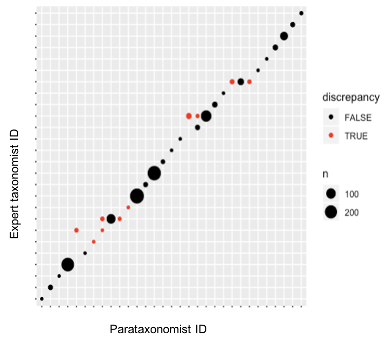
```

(the next section will go into details on sampling design and analysis)

Then we looked at abundance by sampling plot and collection date

```{r, echo=FALSE}
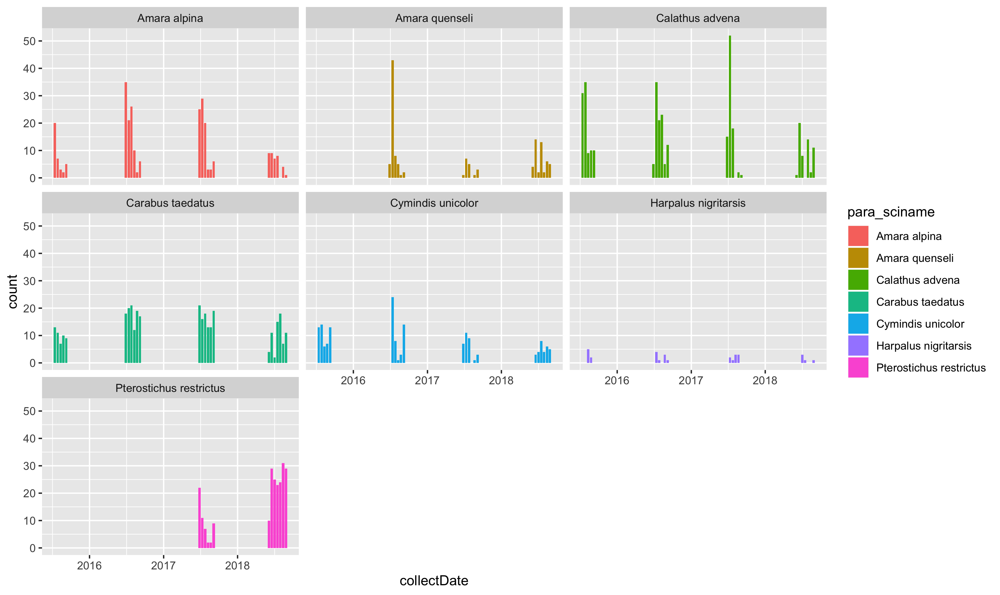
```

Looking at the abundance data, we chose two of those seven: *Carabus taedatus* and *Cymindis unicolor*.

```{r, echo=FALSE}
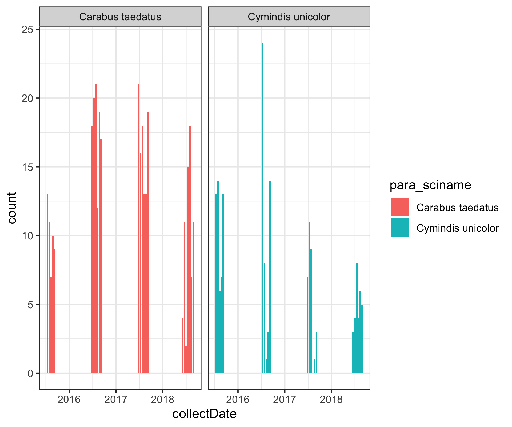
```

<!-- find code to create the distribution by nlcd class and spp image --> 

Both species were consistently present in both of Niwot's landscape classes: tundra and evergreen forest. *C. unicolor* was more abundant in the forested plots and *C. taedatus* was more abundant in the tundra plots. This combination allows us to test our model's accuracy for high and low abundance levels in both habitats.


## Species traits

This information was sparse for our selected species - therefore some of the "specific" phenology information is for the family or genus level. 

In general, carabids are ground-dwelling beetles that prefer moist conditions; note that both of our selected species are xerophilous. Most species are omnivorous as larvae and adults, commonly eating both other arthropods and seeds. The life cycle is 1 year long for most species, with adults living 2-4 years. Most taxa have three instars. Pupation is in the ground.  

### *Carabus taedatus* 
```{r, echo=FALSE, out.width = 100}
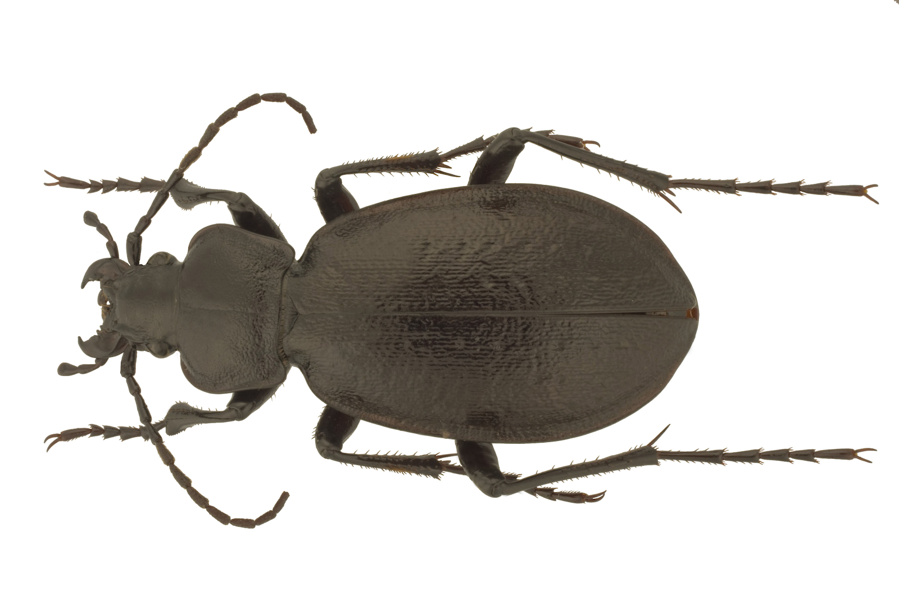
```

**Range**: Nearctic; **Habitat**: Boreal forests. Prefers dry, well-drained environments with thin, low vegetation; **Diet**: both larvae and adults are predatory; **Phenology**: probably overwinters as an adult; **Reproduction**: (genus) Females lay their eggs in specially-constructed cells made of mud, twigs and leaves. 

### *Cymindis unicolor*
```{r, echo=FALSE, out.width = 100}
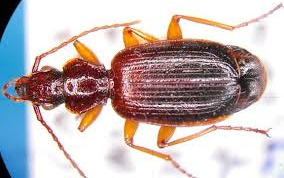
```

**Range**: Holarctic; **Habitat**: An arctic-alpine species occurring in tundra and tundra-forest transition zones; prefers dry, treeless, well-drained environments;  **Diet**: no specific information found; **Phenology**: Little known: In Canada, most specimens were found in June and July, but also found as late as October; **Reproduction**: (genus) Females use ovipositors to create cavities in the earth then deposit their eggs. **Remarks**: The species is relatively rare. The *Lebiini* tribe is found in all the major zoogeographical regions of the world; this genus ranges from Costa Rica to arctic tundra.


```{r, echo=FALSE, warning=FALSE, message=FALSE}
library(knitr)
```

# Q2: EDA

## Carabid data

### Sampling

Carabid beetles were sampled at 10 plots, with 4 traps per plot. Beetles were collected every two weeks during the summer season (with temperature cutoffs to start and stop sampling). Data were available for 2015--2018 (2019 beetles were not yet identified). 


```{r, echo=FALSE}
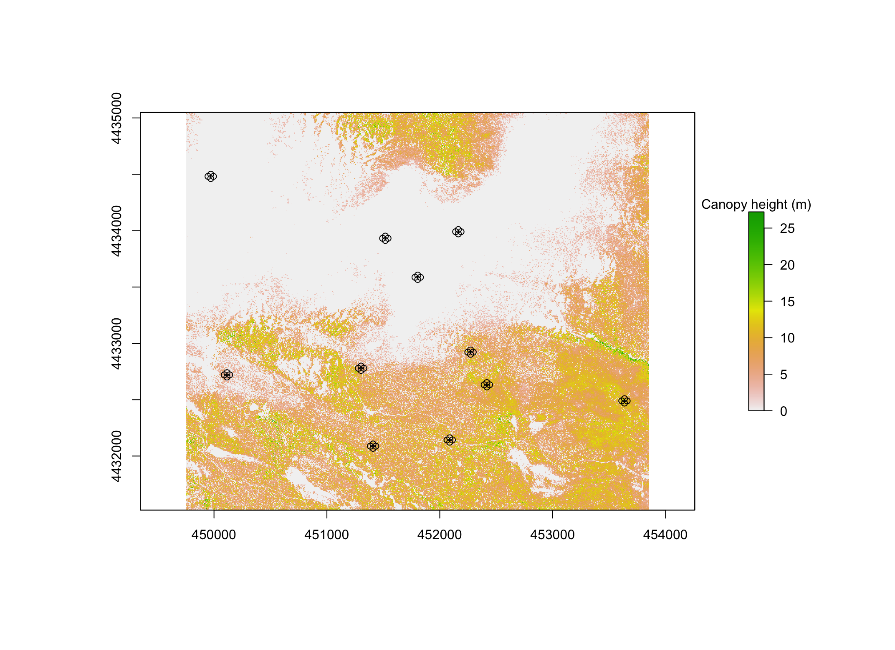
```

In 2018, plot 4 was removed from sampling and plot 13 was added. Plot 4 was forested, and plot 13 is a tundra site. Plot 4 was likely removed from sampling due to low number of beetles caught (speculation from Matt Bitters). We took advantage of the new site in 2018 by using plot 13 as a test plot for our model predictions, which Anna will get to later.

### Identification
All individuals were identified to species (or morphospecies) by a parataxonomist. A subset (1511/1974) of those were then sent for expert identification. There was 97% agreement overall between the parataxonomist and the expert taxonomist.
```{r, echo=FALSE, out.width = 600}
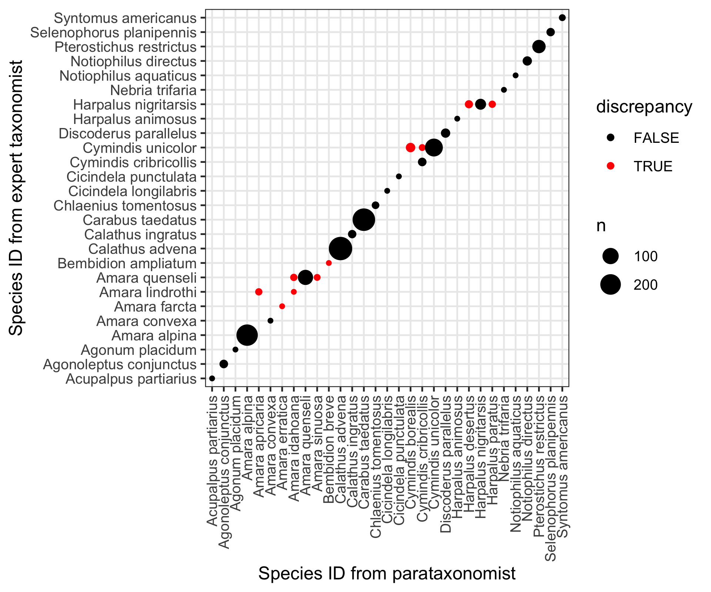
```

<!--  -->


### Species selection 
Most of the species collected were only found rarely, so we first narrowed down the set of species to the seven most abundant (and all were accurately ID'd). 

```{r, echo=FALSE}

```

However, comparing multiple models across seven species is still a bit too much. To narrow further, we selected the two species of these seven that were found both above and below treeline. 

**Selected species**: 

*Carabus taedatus* is more abundant in tundra plots.

```{r, echo=FALSE, out.width = 100}

```

*Cymindis unicolor* is more abundant in forested plots.

```{r, echo=FALSE, out.width = 50}

```

<!-- info/natural history about the species we chose
Do we have an idea for why certain carabids are greater in different nlcdClass given their biology?
-->

We chose these species because we thought it would be interesting to examine model performance for the species that were found in both habitats, especially since they show opposite trends in abundance in the two habitats.

### Abundance over time

<!-- by year -->
<!-- change to just the two species -->
```{r, echo=FALSE}
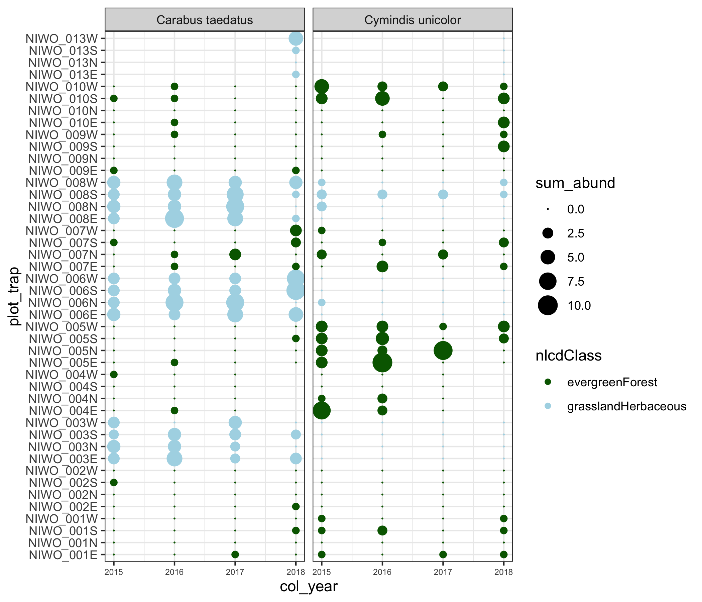
```

This plot shows the abundances at each trap in each year for *Carabus taedatus* and *Cymindis unicolor*. *Carabus taedatus* was reliably caught at the tundra sites and was caught on occasion in some forested sites. *Cymindis unicolor* was reliably caught at some (but not all) forested sites and was caught on occasion at one tundra plot (8) and once at another tundra plot (6). 


## Predictor variables  
At the start of this project we spent some time brainstorming and searching the literature for potentially important predictor variables for carabid abundance. Once we had identified a long list of potential predictors, we searched through the available datasets for usable predictors. We ended up using predictor variables from three sources: NEON data included in the carabid data product, NEON AOP data products, and Niwot Ridge LTER environmental data. The predictors we used from each of these sources will be shown below. There were also several predictor variables that we were not able to use: soil moisture (NEON product, not colocated with beetle traps), woody debris (NEON product, not colocated with beetle traps), vegetation (NEON product, difficult to summarize at plot or trap level), and snowmelt date (didn't find or have time to incorporate).

#### Included with carabid data product
Day of year - extracted from collect date  
NLCD class - evergreen forest or grassland herbaceous  
Elevation  

#### AOP (remote sensing) data products 
Data products from NEON's AOP collection were downloaded via the `neonUtilities` package in the form of multiple (over 100) .tif files in a zip folder for each data product. We then merged together all of the .tif's into a single raster in R (`carabids_01_download_AOP.R`) for each data product. These rasters were then used for all of our downstream analyses.

**Canopy height**  
Measured via LIDAR, this data product provides a 1x1m resolution map of canopy height across the site. To summarize for each trap, we took the average canopy height for a 10m radius from each trap location (see`raster::extract` in `carabids_03_EDA_CHM`). 
```{r, echo=FALSE, out.width = 600}

```


**Leaf area index**  
This is the ratio of leaf area to bare ground area as sensed from above (similar metric to percent canopy cover). This was processed the same way as canopy height, but with some extra data cleaning. Data were available for 2017, 2018, and 2019, but the data looked different year to year. In the end, we used an average of 2017 and 2018 because these issues were difficult to sort out and those years were similar and appeared the most reliable. After contacting someone at NEON, we learned that they used different quality control measures in different years resulting in different values.

**Slope and aspect**  
Slope and aspect were summarized at the plot level (average slope and aspect at 10m radius from plot center). We included them because they may be related to microclimatic factors such as soil moisture (slope) and energy availability via sun exposure (aspect).

```{r, echo=FALSE, out.width = 400}
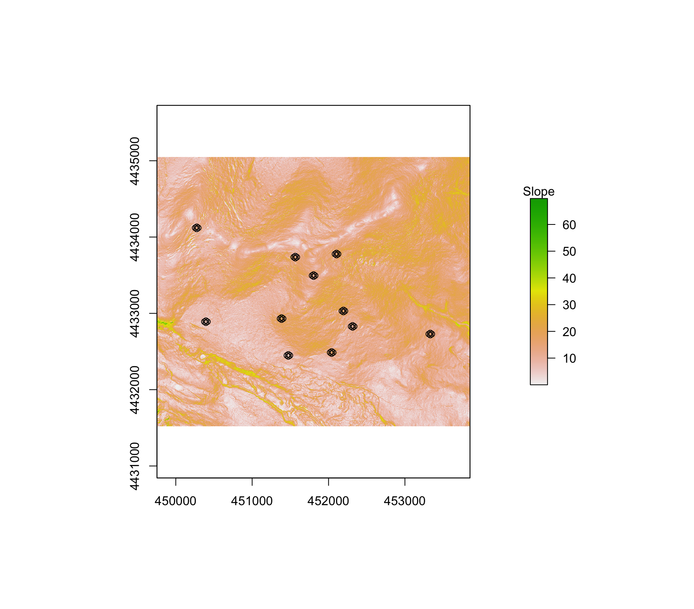
```
```{r, echo=FALSE, out.width = 400}
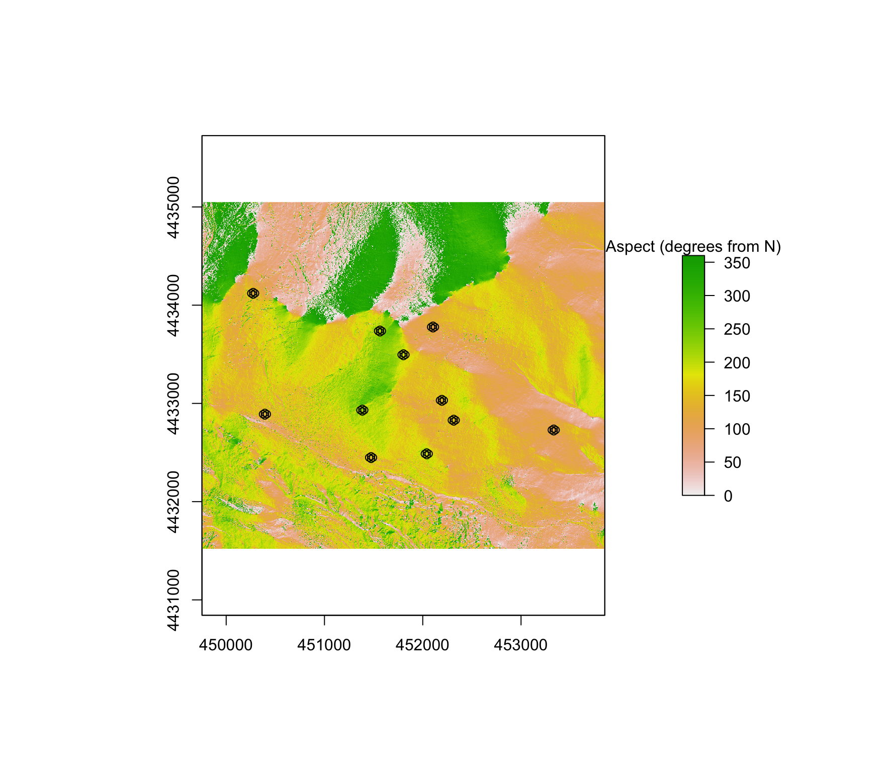
```

#### Niwot Ridge LTER data sources
**Precipitation**  
For the forested plots, C1 precipitation data were used; for the tundra plots Saddle precipitation data were used. [NEON also has a precipitation data product, but there were too many missing data points for our use.] We calculated total precipitation during the collection period (2 weeks) for each collect date. This summary gets at the short-term weather patterns that may influence beetle behavior and detectability in traps. [We wanted to get to a long-term precipitation summary, but ran out of time.]
```{r, echo=FALSE}
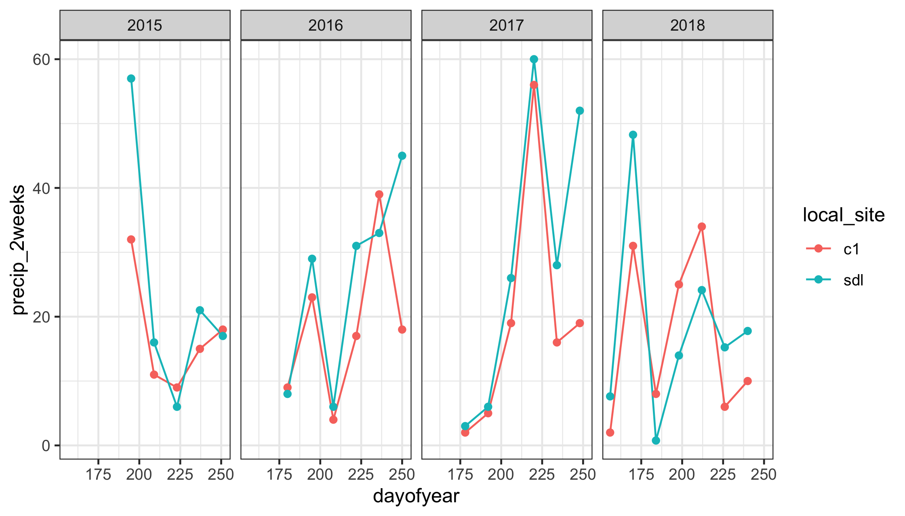
```

**Growing degree days**  
Using temperature data from the C1 sensor (Saddle sensor data contained missing dates), we calculated growing degree days. Growing degree days were summarized similar to (Nufio et al. 2010) as a cumulative sum of growing degree days in that year until the date of collection. Degree days were quantified for temperatures between 12--33C based on grasshopper physiology at Niwot Ridge (Nufio et al. 2010). We did not have any information regarding the carabid temperature limits, so grasshopper values from the same location were our best estimate.
```{r, echo=FALSE}
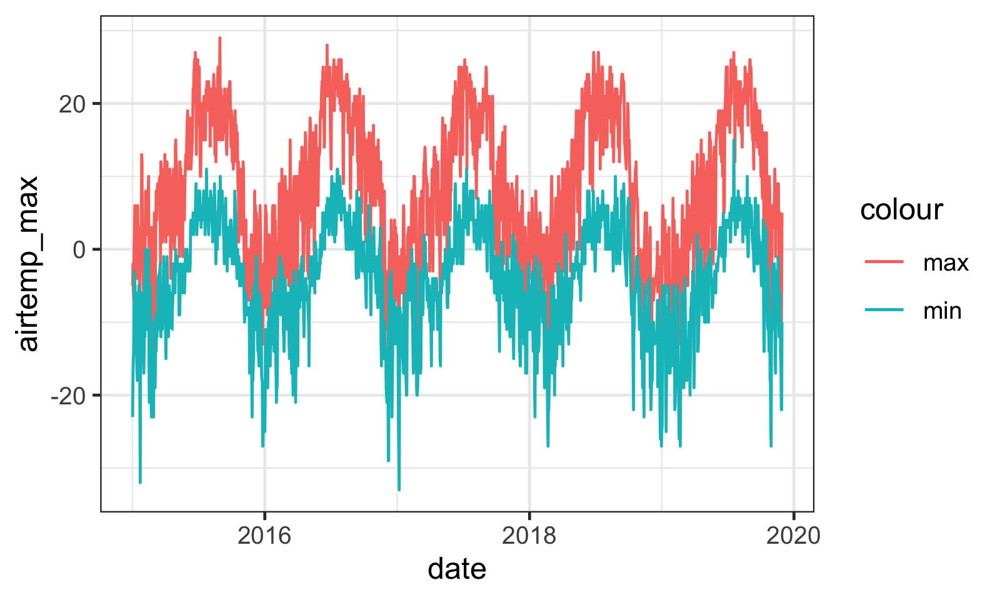
```

```{r, echo=FALSE}
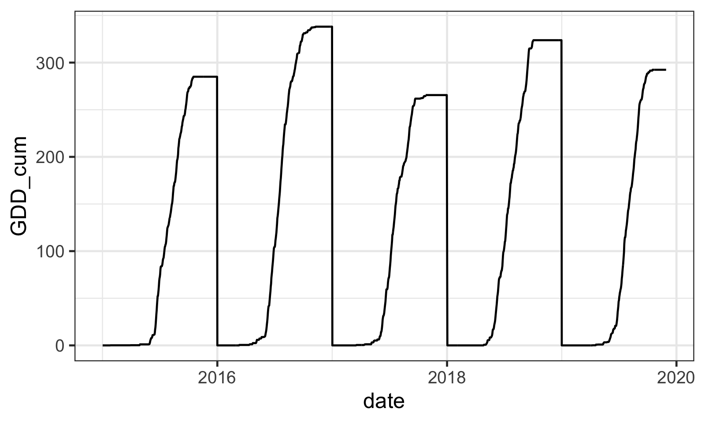
```


### Summary of predictors used in models

* Day of year
* NLCD class
* Elevation
* Canopy height (10m radius)
* Leaf area index (LAI) (10m radius)
* Slope
* Aspect
* Precipitation (during trapping period)
* Growing degree days (cumulative over season)


# Q3 and 4: Model building and selection

```{r, echo = FALSE, results=FALSE, message = FALSE, warning = FALSE}
library(dplyr)
library(mctest)     #omcdiag()
library(tidyr)      #gather()
library(ggplot2)
library(gridExtra)  #grid.arrange
library(broom)      #glance
library(MuMIn)      #model.sel
library(brms)       #brm()
library(mgcv)       #gam()
library(gratia)     #draw()
  
# Load in model df
all7sp_dat <- read.csv("data_derived/model_df_by_species_in_sample.csv") %>%
    mutate(sc_DOY = scale(DOY, center = TRUE, scale = TRUE),
           col_year_fac = as.factor(col_year))
```

To build and select a model for abundance of *Carabus taedatus* and *Cymindis unicolor*, our goals were to:  
    1. Identify what are the key predictor variables for each species.   
    2. Find what model best fits the training data species abundance.  

#### Predictor variable selection

We ruled out some variables by evaluating collinearity with the `mctest` package.

```{r, echo = FALSE}
vars_mat <- all7sp_dat %>%
    mutate(nlcdclass_num = as.numeric(nlcdClass)) %>%
    dplyr::select(elev, LAI_1718avg, plot_CHM, LAI_1718avg, precip_2weeks,
                  DOY, plot17aspect, plot17slope, GDD_cum, col_year, nlcdclass_num)
                  
pairs(vars_mat, pch=20, cex=0.75, col="dodgerblue", main="Correlation scatterplots of every possible predictor") 
```

Note the nearly perfect correlation between growing degree-days and day of year. Comparing all possible variables, we detect overall collinearity between elevation, canopy height, and NLCD class.  

```{r, echo = FALSE}
imcdiag(vars_mat, all7sp_dat$sp_abund, method="VIF") 
```

After dropping elevation, we failed to detect pairwise collinearity between variables. However, variance inflation factor (VIF) values are above 5 (indicating high correlation) for canopy height, NLCD class, day of year, and cummulative growing degree-day. 

```{r, echo = FALSE}
# remove elevation
vars_mat <- all7sp_dat %>%
    mutate(nlcdclass_num = as.numeric(nlcdClass)) %>%
    dplyr::select(LAI_1718avg, plot_CHM, LAI_1718avg, precip_2weeks, DOY,
                  plot17aspect, plot17slope, GDD_cum, col_year, nlcdclass_num)
imcdiag(vars_mat, all7sp_dat$sp_abund, method="VIF") 
```

Canopy height and NLCD class are highly correlated because canopy height is 0 in the tundra. NLCD class is useful in model building since we can vary the intercept by this categorical variable. 

Day of year and growing degree-day are highly correlated. Both capture seasonal variation. 

We don't have enough information right now to select which variable to rule out of each pair. Model fitting with these variables can help us decide. Let's take a step in this direction by utilizing Melissa's `stepGAM` function to compare model AIC values for every iteration of these variables combined. 

Second, use Melissa's stepGAM(), a wrapper function for stepAIC that is compatible with GAMs, to see which predictor variables are important in model fit. 

The effects of plot, trap within plot, canopy height, and slope/aspect are strong for both species. For *Cymindis unicolor* we also see the interaction of day of year and precipitation as an important effect. 

```{r, echo = FALSE, results=FALSE, message = FALSE, warning = FALSE}
load("data_derived/stepGAM_output_cartae.Rdata")
load("data_derived/stepGAM_output_cymuni.Rdata")

allAIC_cartae_filt <- allAIC_cartae %>% 
    filter(!is.na(AIC)) %>% arrange(AIC) %>%
    mutate(rank=seq(1:length(AIC))) %>% 
    mutate(AIC=as.numeric(AIC)
           , Dev.expl = as.numeric(Dev.expl)
           , REML = as.numeric(REML))# %>%
    #filter(AIC<500)

allAIC_cartae_plot <- allAIC_cartae_filt %>% 
    gather(-c(AIC, REML, Dev.expl, formula,rank), key=Predictor, value=WithPredictor) %>% 
  select(AIC, REML, Dev.expl, Predictor, WithPredictor) %>%
  mutate(WithPredictor = ifelse(WithPredictor==0, F, T)) %>%
  ggplot() + 
    geom_violin(aes(x=WithPredictor, y=AIC), col="dodgerblue")  +  
    ggtitle("Carabus taedatus") +
    facet_wrap(.~Predictor) 


allAIC_cymuni_filt <- allAIC_cymuni %>% 
    filter(!is.na(AIC)) %>% arrange(AIC) %>%
    mutate(rank=seq(1:length(AIC))) %>% 
    mutate(AIC=as.numeric(AIC)
           , Dev.expl = as.numeric(Dev.expl)
           , REML = as.numeric(REML))# %>%
    #filter(AIC<500)
 
allAIC_cymuni_plot <- allAIC_cymuni_filt %>% 
    gather(-c(AIC, REML, Dev.expl, formula,rank), key=Predictor, value=WithPredictor) %>% 
  select(AIC, REML, Dev.expl, Predictor, WithPredictor) %>%
  mutate(WithPredictor = ifelse(WithPredictor==0, F, T)) %>%
  ggplot() + 
    geom_violin(aes(x=WithPredictor, y=AIC), col="dodgerblue")  +  
    ggtitle("Cymindis unicolor") +
    facet_wrap(.~Predictor) 

grid.arrange(allAIC_cartae_plot,allAIC_cymuni_plot,nrow=1)
```

#### Model selection

Now that we've identified what are the possible key predictor variables to include in modeling, let's compare a few modeling approaches. We found that GAMMs performed better than GLMMs as they capture well the seasonal flux in carabid abundance. We used the `mgcv` package for fitting GAMMs. Our initial efforts used a poisson or negative binomial distribution to model carabid abundance. However, predictions were severely biased toward 0, so we should next try a zero-inflated poisson model. While we have a number of environmental variables at our disposal to use as predictors, we learned from Harris et al. 2018 that simply an average model may yield the best predictions, even if it's not the best fit model. For this reason, we will compare the model results from the best baseline (variance partitioning) and negative binomial models. First, we iterated through models with many combinations of environmental predictors. 

The best fit model for each species utilized distinct environmental predictor variables. Since we observe clear differences in abundance between NLCD class types for each species, we had the models fit different smooths of continuous variables to each type of NLCD class.  Models for both species used grouping variables that are artifacts of the sampling structure:  
* collection date (24 total)  
* collection year (4 total)  
* plot (10 across site)  
* traps within plots (4 per plot)  

For *Carabus taedatus*, the following environmental predictors were used:  
* day of year  
* canopy height  
* accumulated precipitation over collection period  
* interaction of precipitation and day of year  
* interaction of slope and aspect  

For *Cymindis unicolor*, the following environmental predictors were used:  
* cummulative growing degree days  
* LAI  
* accumulated precipitation over collection period  
* interaction of slope and aspect  
* interaction of precipitation and day of year  
* interaction of growing degree days and precipitation  

```{r, echo = FALSE}
load("data_derived/final_mod_cartae.Rdata")
load("data_derived/final_mod_cymuni.Rdata")

# View selected model formulae
cartae_mod$formula
cymuni_mod$formula
```


# Results & Interpretation

## Biological interpretation
Many of the models we selected between had comparable AIC values, so we chose ones that would be most easily interpreted biologically. Now let's interpret them. 

First, let's look at the output of the variance partition model for each species to see where the variability in the data sit.Note that the variance partition model explains over half of the deviance in the data already!

```{r}
load("data_derived/vp_mod_cartae.Rdata")
load("data_derived/vp_mod_cymuni.Rdata")
summary(vp_mod_cymuni)
```

Now let's look at the best-fit GAMM result plots.

```{r}
summary(cartae_mod)
plot(cartae_mod, pages = 5, rug = TRUE, residuals = TRUE, shade=TRUE, shade.col = "lightblue", all.terms = TRUE, seWithMean = TRUE, shift = coef(cartae_mod)[1], scheme=2)

```

```{r}
summary(cymuni_mod)
plot(cymuni_mod, pages = 5, rug = TRUE, residuals = TRUE, shade=TRUE, shade.col = "lightblue", all.terms = TRUE, seWithMean = TRUE, shift = coef(cymuni_mod)[1], scheme=2)
```


## Prediction
Given the limited size of the carabid dataset over 4 years and at one site, we will validate our models on data from a single plot in a single year. We trained our models on the rest of the data. Remember that in our last sampling year, 2018, NEON swapped out plot 4 for plot 13. We thought it would be interesting to predict beetle abundance at this new plot, given what we know about the other plots and their abundances. 

```{r, warning=F}
val_dat <- all7sp_dat %>% 
  filter(plotID == "NIWO_013" & col_year == 2018) 

vp_cartae_pred <- cbind(val_dat %>% filter(para_sciname == "Carabus taedatus") %>% select(sp_abund), data.frame(predict(vp_mod_cartae, newdata = val_dat %>% filter(para_sciname == "Carabus taedatus"), type = "response", se.fit= TRUE)))

vp_cymuni_pred <- cbind(val_dat %>% filter(para_sciname == "Cymindis unicolor") %>% select(sp_abund), data.frame(predict(vp_mod_cymuni, newdata = val_dat %>% filter(para_sciname == "Cymindis unicolor"), type = "response", se.fit= TRUE)))

cartae_pred <- cbind(val_dat %>% filter(para_sciname == "Carabus taedatus") %>% select(sp_abund), data.frame(predict(cartae_mod, newdata = val_dat %>% filter(para_sciname == "Carabus taedatus"), type = "response", se.fit= TRUE)))

cymuni_pred <- cbind(val_dat %>% filter(para_sciname == "Cymindis unicolor") %>% select(sp_abund), data.frame(predict(cymuni_mod, newdata = val_dat %>% filter(para_sciname == "Cymindis unicolor"), type = "response", se.fit= TRUE)))

plot_vp_cartae_pred <- vp_cartae_pred %>%
  ggplot(aes(x=fit, y=sp_abund)) +
  geom_jitter(col="dodgerblue") +
  geom_abline(slope = 1, intercept = 0, col="dodgerblue") +
  ggtitle("Var. Part. model for Carabus taedatus") +
  xlim(0,5) +  ylim(0,5) +
  ylab("Observed count" ) +
  xlab("Predicted count")
plot_vp_cymuni_pred <- vp_cymuni_pred %>%
  ggplot(aes(x=fit, y=sp_abund)) +
  geom_jitter(col="dodgerblue") +
  geom_abline(slope = 1, intercept = 0, col="dodgerblue") +
  ggtitle("Var. Part. model for Cymindis unicolor") +
  xlim(0,5) +  ylim(0,5) +
  ylab("Observed count" ) +
  xlab("Predicted count")
plot_cartae_pred <- cartae_pred %>%
  ggplot(aes(x=fit, y=sp_abund)) +
  geom_jitter(col="dodgerblue") +
  geom_abline(slope = 1, intercept = 0, col="dodgerblue") +
  ggtitle("Best fit model for Carabus taedatus") +
  xlim(0,5) +  ylim(0,5) +
  ylab("Observed count" ) +
  xlab("Predicted count")
plot_cymuni_pred <- cymuni_pred %>%
  ggplot(aes(x=fit, y=sp_abund)) +
  geom_jitter(col="dodgerblue") +
  geom_abline(slope = 1, intercept = 0, col="dodgerblue") +
  ggtitle("Best fit model for Cymindis unicolor") +
  xlim(0,5) +  ylim(0,5) +
  ylab("Observed count" ) +
  xlab("Predicted count")

grid.arrange(plot_vp_cartae_pred,plot_vp_cymuni_pred,plot_cartae_pred,plot_cymuni_pred,nrow=2)

```

Our models can predict absence or low abundance, but not more. This is support for trying a zero-inflated poisson next. 


## Cross-validation
We chose the K-fold cross validation method. 
```{r}
# all7sp_dat_cartae_k <- all7sp_dat %>% 
#   filter(para_sciname=="Carabus taedatus") %>%
#   mutate(k = sample(1:20, 960, replace=T))
# all7sp_dat_cymuni_k <- all7sp_dat %>% 
#   filter(para_sciname=="Cymindis unicolor" ) %>%
#   mutate(k = sample(1:20, 960, replace=T))
# 
# err_cartae <- rep(NA,960)
# for (i in 1:20 ) {
#     gamcartae_loo <- gam(formula = sp_abund ~ nlcdClass + s(DOY, bs = "cc", k = 3) + 
#                            s(precip_2weeks, by = nlcdClass, bs = "ts", k = 3) + 
#                            s(plot_CHM,bs = "ts", k = 3) + 
#                            te(DOY, precip_2weeks, by = nlcdClass, bs = c("cc", "ts"), k = 3) +
#                            te(plot17aspect, plot17slope, bs = c("ts", "ts"), k = 3) + 
#                            s(collectDate, bs = "re") + s(col_year_fac, bs = "re") + 
#                            s(plot_trap, bs = "re") + s(plotID, bs = "re"), family = nb, 
#                          data = all7sp_dat_cartae_k %>% filter(k != i), method = "REML")
#       
#     err_temp <- ( predict(gamcartae_loo,newdata=all7sp_dat_cartae_k %>% filter(k == i)) -
#                          all7sp_dat_cartae_k %>% filter(k == i) %>% select(sp_abund) )^2 #MSE
#     err_cartae <- rbind(err_cartae, err_temp)
#     rm(gamcartae_loo, err_temp)
# }
# err_cartae <- err_cartae[-1,]
# CV_cartae <- mean(err_cartae)
# 
# err_cymuni <-rep(NA,960)
# for (i in 1:20 ) {
#     gamcymuni_loo <- gam(formula = sp_abund ~ nlcdClass + s(GDD_cum, bs = "ts", k = 1) + 
#                            s(LAI_1718avg, bs = "ts", k = 1) + 
#                            s(precip_2weeks, bs = "ts", k = 1) + 
#                            te(GDD_cum, precip_2weeks, bs = c("ts", "ts"), k = 3) + 
#                            te(plot17aspect, plot17slope, by = nlcdClass, bs = c("ts", "ts"), k = 5) +
#                            te(DOY, precip_2weeks, bs = c("cc", "ts"), k = 4) + 
#                            s(collectDate, bs = "re") + s(col_year_fac, bs = "re") + 
#                            s(plot_trap, bs = "re") + s(plotID, bs = "re"), family = nb, 
#                          data = all7sp_dat_cymuni_k %>% filter(k != i), method = "REML")
#       
#     err_temp <- ( predict(gamcymuni_loo,newdata=all7sp_dat_cymuni_k %>% filter(k == i)) -
#                          all7sp_dat_cymuni_k %>% filter(k == i) %>% select(sp_abund) )^2 #MSE
#     err_cymuni <- rbind(err_cymuni, err_temp)
#     rm(gamcymuni_loo, err_temp)
# }
# err_cymuni <- err_cymuni[-1,]
# CV_cymuni <- mean(err_cymuni)
# 
# err_cartae <- rep(NA,960)
# for (i in 1:20 ) {
#     gamcartae_vp_loo <- gam(formula = sp_abund ~
#                            s(collectDate, bs = "re") + s(col_year_fac, bs = "re") + 
#                            s(plot_trap, bs = "re") + s(plotID, bs = "re"), family = nb, 
#                          data = all7sp_dat_cartae_k %>% filter(k != i), method = "REML")
#       
#     err_temp <- ( predict(gamcartae_vp_loo,newdata=all7sp_dat_cartae_k %>% filter(k == i)) -
#                          all7sp_dat_cartae_k %>% filter(k == i) %>% select(sp_abund) )^2 #MSE
#     err_cartae <- rbind(err_cartae, err_temp)
#     rm(gamcartae_vp_loo, err_temp)
# }
# err_cartae <- err_cartae[-1,]
# CV_cartae_vp <- mean(err_cartae)
# 
# err_cymuni <-rep(NA,960)
# for (i in 1:20 ) {
#     gamcymuni_vp_loo <- gam(formula = sp_abund ~
#                            s(collectDate, bs = "re") + s(col_year_fac, bs = "re") + 
#                            s(plot_trap, bs = "re") + s(plotID, bs = "re"), family = nb, 
#                          data = all7sp_dat_cymuni_k %>% filter(k != i), method = "REML")
#       
#     err_temp <- ( predict(gamcymuni_vp_loo,newdata=all7sp_dat_cymuni_k %>% filter(k == i)) -
#                          all7sp_dat_cymuni_k %>% filter(k == i) %>% select(sp_abund) )^2 #MSE
#     err_cymuni <- rbind(err_cymuni, err_temp)
#     rm(gamcymuni_vp_loo, err_temp)
# }
# err_cymuni <- err_cymuni[-1,]
# CV_cymuni_vp <- mean(err_cymuni)
# 
# # Compare models
# save(CV_cartae, CV_cymuni, CV_cartae_vp, CV_cymuni_vp, file="data_derived/cv_output.Rdata")

load("data_derived/cv_output.Rdata")
CV_mat <- matrix(c(CV_cartae, CV_cymuni, CV_cartae_vp, CV_cymuni_vp), nrow=2, byrow=T)
rownames(CV_mat) <- c("best fit", "var par")
colnames(CV_mat) <- c("Car tae", "Cym uni")
CV_mat
```


# Discussion - Did we do what we set out to do?

We did meet our primary semester goal:

To create a working model to accurately predict the abundance of 1-2 carabid spp. at NEON's Niwot carabid traps (spatial prediction, Plot 13 in 2018)

This was scaled back quite a bit from our early aspirations. And we did not meet some of our larger goals, including running a working cross-validation

## Future work

If we had more time (and data), we'd include the following items: 

* Once the 2019 carabid data is identified, we'd try to predict our two species for 2019 at all plots and collection dates

* If successful, we'd try to predict all 7 abundant species

* Regardless of outcome, we'd try to use our model to answer the question: "How much data is enough?" for accurate forcasting at different timesteps
